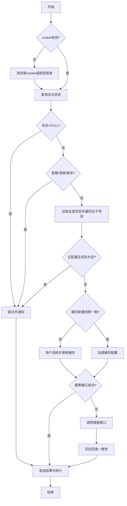

# Terminus EMP Skill

用于 openclaw 的 EMP 工时填报规范（API 优先，执行器自选）。

## 1. 使用条件

1. 建议触发词：`填工时`、`工时填报`、`补工时`、`自动填报`、`工时统计`、`工时周报`。
2. 反例词（默认不触发写入）：`只查询项目`、`只看状态`、`仅查看`、`不填报`。
3. 命中策略：命中触发词且未命中反例词，进入执行流程；否则仅执行查询/解释。
4. 范围：工作日当天自动填报；历史日期仅人工触发。

## 2. 执行前门槛（未满足则只收集参数）

1. `auth`：`emp_cookie`（优先）或账密。
2. `targetDate`：目标日期，默认当天（`Asia/Shanghai`）。
3. `project_config`：至少 1 条，包含 `projectType/projectCode/detailCode/detailName/percentage`。
4. 同日多条配置的 `percentage` 合计必须 `1.0`。

### 2.1 项目选择交互规范
1. 项目清单展示必须按“项目 -> 子项目”缩进输出。
2. 当存在多个项目时，按项目分组后依次展示每个项目的全部子项目。
3. 用户选择最小输入：`projectCode + detailCode + percentage`。
4. `projectType/detailName` 由已拉取清单自动补全；若无法唯一匹配再要求用户补充。
5. 多项目分摊采用分行输入，每行一条配置。
6. 多条配置 `percentage` 合计必须 `1.0`，否则中断并提示修正。

## 3. 执行流程

1. 凭据检查：先验 cookie，失效则请求新 cookie 或账密。
2. 当天状态检查：`FULL` 跳过；`UNDER_FILL/NOT_FILL_OUT` 继续。
3. 跳过判定：周末/法定假日/请假日直接跳过并通知。
4. 项目加载（强制）：先调用 `get_user_current_projects` 拉取全部项目，再遍历每个 `projectCode/type` 调用 `query_subproject_details` 拉取全部子项目，并合并列表后供用户选择。
5. 空项目中断：若 `project_config` 不存在且项目列表为空，直接提示“当前无可用项目，无法自动填报”，并中断写入流程。
6. 缓存校验：校验 `lastVerifiedAt/source/projectSnapshotHash`，不一致则要求重选并更新缓存。
7. 幂等检查：按 `staffId + fillDate + projectCode + detailCode` 防重复写入。
8. 执行写入：按配置比例填报（同日总比例 `1.0`）。
9. 写后回查：校验 `detailCode + percentage` 与目标一致。
10. 结果通知：发送摘要、失败明细、日报/周报。

### 3.1 流程图

## 4. 关键规则

1. 时区固定：`Asia/Shanghai`。
2. 定时触发：工作日 `10:00`。
3. 自动填报：仅当天。
4. 写接口字段规范：使用 `fillDate + percentage`，禁止 `workDate + ratio`。
5. 同日多条填报比例合计必须 `1.0`。

### 4.1 联调确认（2026-02-25）
1. `get_user_current_projects` 必须传 `req.beginDate/endDate`（毫秒时间戳）。
2. `query_subproject_details` 必须传 `req.beginDate/endDate + baseProjectReq`。
3. 项目选择交互固定为“项目 -> 子项目”缩进展示。
4. 用户最小输入为 `projectCode / detailCode / percentage`，多项目按分行输入。
5. 无 `project_config` 且项目列表为空时，直接中断填报。
6. 当天时间窗口固定为 `00:00:00 ~ 23:59:59`（上海时区）。

## 5. 异常与重试

1. `401/403`：刷新会话后重试 1 次，仍失败则终止。
2. 网络抖动/`5xx`：指数退避重试，最多 2~3 次。
3. `V0311`：服务侧异常，记录 `requestId`，降级人工处理。
4. `非常规操作，请走页面填报~~`：风控拦截，禁止自动重试，切页面方案。
5. 参数错误：禁止自动重试，返回缺失/格式错误明细。
6. 写后回查不一致：标记“写入未知态”，通知人工复核。

## 6. 安全要求

1. 禁止将账号密码写入仓库。
2. cookie 禁止明文持久化。
3. 日志需脱敏（手机号/邮箱/账号）。

## 7. 参考文档

1. 接口路径、headers、入参/出参样例、参数说明：`references/api-map.md`
