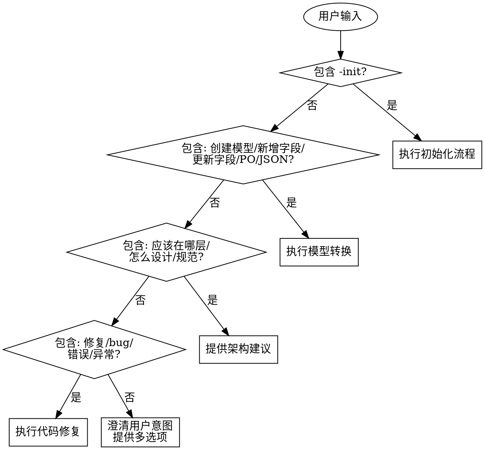

# terp-developer

## Overview

智能开发助手，用于 Trantor2 框架项目的模型驱动开发、架构指导和代码规范管理。核心能力：模型双向转换（PO ↔ JSON）、全链路影响分析、语义冲突检测、外部模型知识库自动构建。

## 快速开始

```bash
# 初始化项目
/terp-developer -init

# 创建模型（从 JSON 字段定义）
/terp-developer 创建 SettAccountPO

# 更新模型
/terp-developer 给 SettItemTrPO 新增 5 个字段

# 导出模型（PO → JSON）
/terp-developer 将 SettDocTrPO 导出为 JSON

# 架构咨询
/terp-developer 结算单创建逻辑应该放在哪层？

# 代码修复
/terp-developer 修复 SettItemTrService 的集合判空问题
```

## 参数说明

| 参数 | 说明 |
|------|------|
| `-init` | 初始化项目，增强 CLAUDE.md，构建知识库 |
| `[model-name]` | 模型名称（如 SettAccountPO），支持创建、更新、导出操作 |
| `[JSON-array]` | JSON 字段定义数组，可直接粘贴或提供文件路径 |
| `[file-path]` | JSON 字段定义文件路径 |

**JSON 字段类型支持**：
- `TEXT` - 文本类型
- `NUMBER` - 数字类型（支持 intLength、scale、numberDisplayType）
- `DATE` - 日期类型
- `ENUM` - 枚举类型（支持 dictPros.dictValues）
- `BOOL` - 布尔类型
- `OBJECT` - 关联对象类型（支持 relationMeta）

## 智能路由逻辑



## 核心工作流

### 模型转换（JSON → PO）

**必需输入：**
- JSON 字段定义数组（文件路径或直接粘贴）
- 目标模型名称（如 SettAccountPO）

**执行步骤：**

1. **输入验证**
   - 检测参数类型（文件路径 → Read，JSON内容 → 解析）
   - 验证 JSON 格式（必需字段：key, name, props.fieldType）
   - 验证 fieldType 合法性（TEXT/NUMBER/DATE/ENUM/BOOL/OBJECT）

2. **操作类型判断**
   - 使用 Glob 查找目标 PO 是否存在
   - 存在 → 更新模式（对比字段差异）
   - 不存在 → 创建模式（生成完整脚手架）

3. **影响分析（详见 references/impact-analysis.md）**
   - PO/DTO 同步检查
   - Converter 自定义映射检查
   - Repository 硬编码字段检查
   - Service 业务逻辑影响
   - Action 层暴露检查
   - 跨模块依赖检查
   - 测试和 i18n 检查

4. **语义冲突检测（必需步骤）**
   ```markdown
   检查规则：
   - 字段类型变更（String → Integer）
   - 关联模型变更（mat_id：物料 → 商品）
   - 字段注释语义变化

   检测到冲突时：
   ⚠️  阻止自动执行，提供方案选择
   ```

5. **确认机制**
   - 生成影响评估报告
   - 标记：✏️ 必须修改、⚠️ 需确认、✅ 无影响、❓ 跨模块
   - 等待用户确认后执行

6. **执行修改**
   - 使用 Write 创建新文件
   - 使用 Edit 更新现有文件
   - **⚠️ 强制步骤：更新知识库（dependency-knowledge.json）**
     ```markdown
     必须执行：
     1. 提取所有 OBJECT 类型字段的 relationMeta
     2. 识别外部模型（relationModelAlias 以 GEN_MD$ 或其他模块前缀开头）
     3. Read dependency-knowledge.json
     4. 更新 externalModels 部分：
        - 新增模型：添加完整记录（module, description, usageFields, commonFields）
        - 已有模型：更新 usageFields、递增 useCount、更新 lastUsed
     5. Write 更新后的 dependency-knowledge.json

     禁止：
     - ❌ 创建/更新模型后不更新知识库
     - ❌ 只记录部分外部模型
     - ❌ 跳过 useCount 和 lastUsed 更新
     ```

**禁止行为：**
- ❌ 跳过影响分析直接修改
- ❌ 字段类型映射使用默认假设（必须显式定义）
- ❌ 忽略语义冲突继续执行
- ❌ 不经确认修改跨模块代码

### 模型转换（PO → JSON）

**必需输入：**
- PO 类名或文件路径

**执行步骤：**

1. 查找 PO 文件（Glob）
2. 解析注解（@TableName, @TableField, @ApiModelProperty）
3. **字段类型映射与语义嗅探**（详见 references/field-mapping.md）
   - **⚠️ 强制规则**：识别 `Id` 结尾字段，自动映射为 `OBJECT` 类型并补全 `relationMeta`。
4. **生成标准 JSON 格式**
   - **⚠️ 强制规则**：JSON 的 `key` 必须使用**下划线命名法**（物理字段名），严禁使用驼峰命名法。
5. 输出到控制台或文件（doc/models/{EntityName}_fields.json）

**⚠️ 强制步骤：知识库更新**
```markdown
必须执行：
1. 提取所有 OBJECT 类型字段的 relationMeta
2. 识别外部模型（relationModelAlias）
3. Read dependency-knowledge.json
4. 更新 externalModels 部分：
   - 新增模型：添加完整记录
   - 已有模型：更新 usageFields、useCount、lastUsed
5. Write 更新后的 dependency-knowledge.json

禁止：
- ❌ 导出模型后不更新知识库
- ❌ 只记录部分外部模型
- ❌ 跳过 useCount 和 lastUsed 更新
```

### 初始化项目（-init）

**智能融合流程：**

1. **检查 CLAUDE.md**
   - 不存在 → 调用系统 /init
   - 存在 → 分析现有章节

2. **内容融合（而非简单追加）**
   ```markdown
   分析已有章节：
   - 已存在"编码约定" → 合并内容，去重
   - 不存在 → 追加新章节

   必需步骤：
   - 备份原始文件 → .claude/CLAUDE_bak.md
   - 融合内容，添加生成日期标记
   - Write 更新后的内容
   ```

3. **构建知识库**
   - 扫描 pom.xml 识别外部依赖
   - 创建项目级知识库目录
   - 初始化 dependency-knowledge.json, maven-config.json

### 架构咨询

基于 `references/architecture.md` 提供指导：

```markdown
用户: "结算单创建逻辑应该放在哪层？"

响应结构：
【推荐方案】Service 层
【原因】基于 Trantor2 架构规范（引用 architecture.md 第X章）
【代码示例】
【是否需要生成代码？】
```

**禁止行为：**
- ❌ 提供通用 Spring Boot 建议（必须引用项目规范）
- ❌ 不检查现有代码库模式就回答

### 代码修复

基于 `references/code-pattern.md` 检查和修复：

```markdown
检查规则：
1. 集合判空：使用 CollectionUtils.isNotEmpty()
2. 字符串判空：使用 StrUtil.isBlank()
3. 主键生成：使用 IdGenerator.nextId()
4. Repository查询：使用 LambdaQueryWrapper

修复流程：
1. Grep 搜索不规范代码模式
2. 提供修复建议并预览
3. 确认后执行 Edit
```

## 知识库管理 ⚠️ 强制要求

**知识库路径（仅项目级）：**
```
<project-root>/.claude/terp-developer/knowledge/
├── dependency-knowledge.json    # 外部模型知识（强制更新）
├── maven-config.json            # Maven 配置记忆
├── field-history.json           # 字段语义历史
└── impact-cache/                # 影响分析缓存
```

### 文件说明

**dependency-knowledge.json** - 外部模型知识库
- **作用**：记录项目中使用的外部模型及其关系，实现跨会话记忆和学习
- **内容结构**：
  ```json
  {
    "projectName": "erp-sett",
    "version": "项目版本",
    "dependencies": { "内部依赖信息" },
    "externalModels": {
      "GEN_MD$org_struct_md": {
        "module": "来源模块",
        "description": "模型含义",
        "type": "external/internal",
        "usageFields": { "使用该模型的PO": ["字段列表"] },
        "commonFields": { "常用字段": "字段说明" },
        "commonQueries": [ "常用查询方法" ],
        "lastUsed": "最后使用日期",
        "useCount": "使用次数"
      }
    }
  }
  ```
- **更新时机**：模型创建/更新/导出时强制更新
- **用途**：避免重复询问外部模型信息，实现知识复用

**maven-config.json** - Maven 配置记忆
- **作用**：记录项目 Maven 构建配置，避免重复询问
- **内容结构**：
  ```json
  {
    "mavenVersion": "3.x",
    "javaVersion": "17",
    "projectRoot": "项目路径",
    "parent": { "父POM信息" },
    "modules": ["模块列表"],
    "buildOrder": "构建顺序",
    "codeGeneration": { "代码生成配置" },
    "properties": { "Maven属性" },
    "initialized": "初始化日期"
  }
  ```
- **更新时机**：项目初始化（-init）时创建
- **用途**：快速获取项目构建信息，跳过配置询问

**field-history.json** - 字段语义历史（预留）
- **作用**：记录字段语义变更历史，用于语义冲突检测
- **内容结构**：
  ```json
  {
    "mat_id": [
      {
        "date": "2026-03-05",
        "semantic": "物料编码",
        "relationModel": "GEN_MD$gen_mat_md",
        "changedBy": "user or auto-detect"
      }
    ]
  }
  ```
- **更新时机**：字段语义变更时记录
- **用途**：检测语义冲突（如 mat_id 从物料变更为商品）

**impact-cache/** - 影响分析缓存（预留）
- **作用**：缓存影响分析结果，加速重复分析
- **内容**：按模型名称存储分析结果
- **用途**：避免重复执行全链路影响分析

**⚠️ 强制记录原则：**

知识库记录**不是可选操作**，是**强制性要求**。任何涉及外部模型信息的操作必须同步更新知识库。

**强制更新触发时机：**

1. ✅ **模型创建/更新时** - 必须记录新增的外部模型关联
2. ✅ **模型导出时（PO → JSON）** - 必须提取并记录所有 relationMeta 外部模型
3. ✅ **模型查询时** - 必须更新 useCount 和 lastUsed
4. ✅ **初始化项目时** - 必须扫描并记录所有外部依赖

**知识库操作：**
- 读取：Glob 检查存在 → Read 读取 JSON
- 不存在 → 返回空知识库（不报错）
- 写入：**强制写入** - 首次创建目录 → Write JSON 文件 → 更新 useCount 和 lastUsed

**外部模型知识库详细规范：**
详见 `references/external-models.md`

## 模板文件

代码模板位于 `assets/templates/`:
- po-template.java
- dto-template.java
- converter-template.java
- repository-template.java
- domain-service-template.java
- app-service-template.java
- action-template.java

## 高级功能

- **语义冲突检测**：详见 `references/field-mapping.md`
- **跨模块影响分析**：详见 `references/impact-analysis.md`
- **外部模型查询**：详见 `references/external-models.md`

## 常见错误

| 错误 | 修复 |
|------|------|
| Maven 配置缺失 | 提供选择：显式配置 / 使用默认 / 跳过编译检查 |
| PO 类不存在 | 引导创建或修正类名 |
| JSON 格式错误 | 指出具体错误位置和必需字段 |
| 语义冲突 | 阻止执行，提供方案选择 |

## Red Flags - STOP and Start Over

- 跳过影响分析直接修改代码
- 字段类型映射使用假设而非显式定义
- 忽略语义冲突警告继续执行
- 简单追加 CLAUDE.md 而不融合内容
- 不检查跨模块依赖就修改模型
- **⚠️ 导出/修改模型后不更新知识库（dependency-knowledge.json）**
- **⚠️ 只记录部分外部模型，遗漏 relationMeta 关联**
- **⚠️ JSON 输出使用驼峰命名 Key（必须使用下划线）**
- **⚠️ 将关联 ID 简单识别为 NUMBER 类型（必须识别为 OBJECT）**

**以上行为意味着：停止执行，重新按照完整流程开始。**